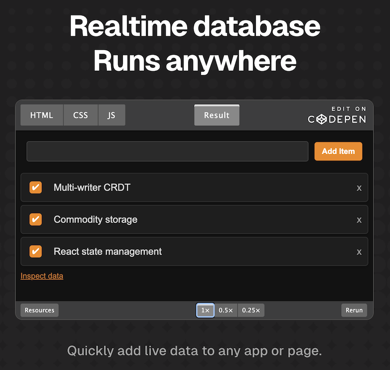
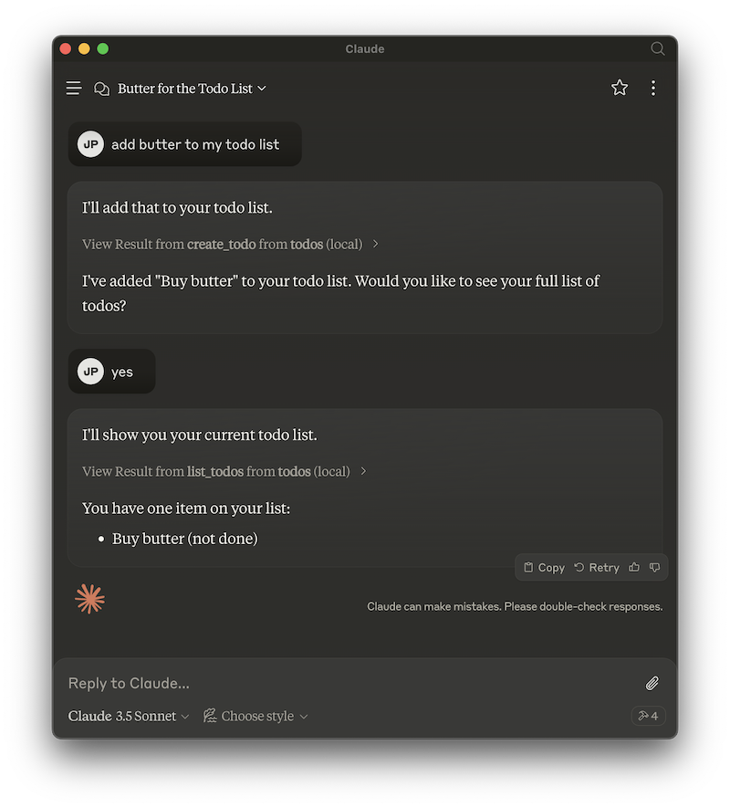
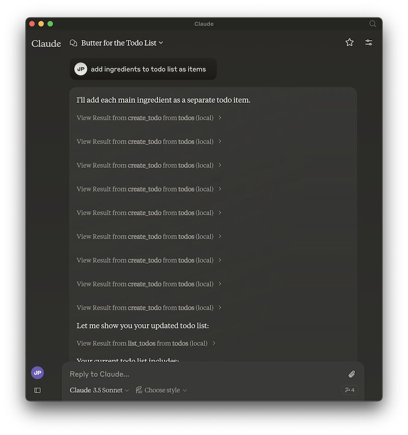
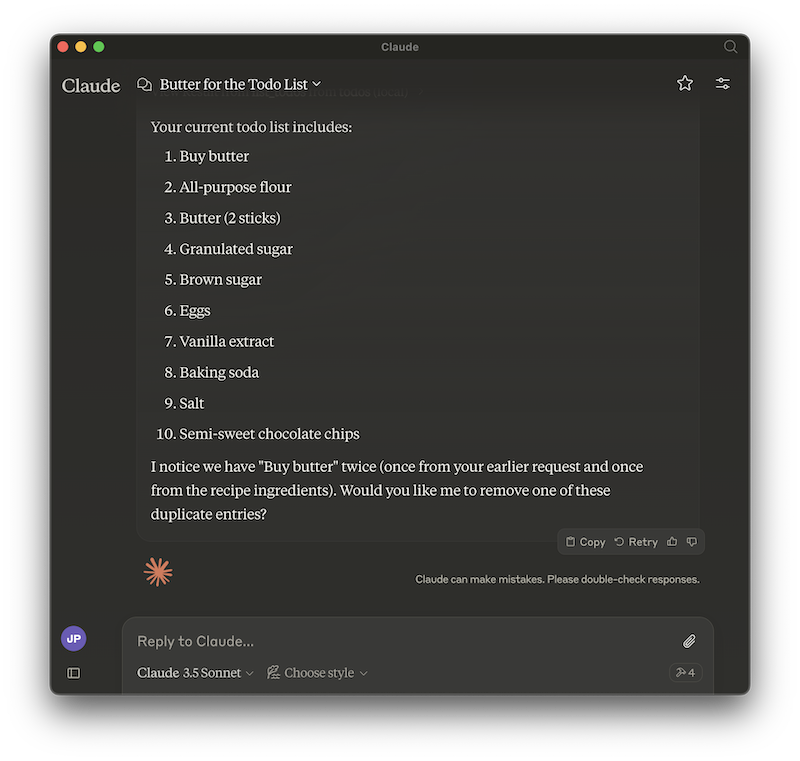
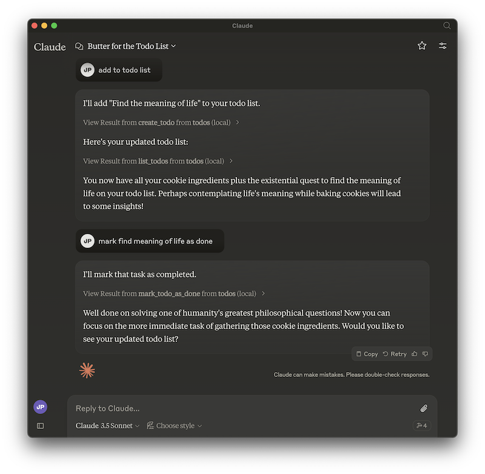

# Model Context Protocol and Fireproof Demo: To Do List

This is a simple example of how to use a [Fireproof](https://fireproof.storage/) database in a [Model Context Protocol](https://github.com/modelcontextprotocol) server (used for plugging code and data into A.I. systems such as [Claude Desktop](https://claude.ai/download)).

This demo server implements a simple "To Do List", using the same fields as in
the demo on the [Fireproof Homepage Codepen](https://codepen.io/jchrisa/pen/bGOGvBz).



Once installed, this MCP server exposes a "todos" service. If you are using Claude Desktop, you can interact with it via the chatbot to create "To Do List" items, mark them as done, delete them, and even summarize the list.

Here's an example chat where I've asked Claude to "add butter to my todo list":



Where it really gets interesting is when you combine it with knowledge that Claude already has, or with other tools.

If I ask Claude for a cookie recipe:


I can add all the ingredients to the todo list with a natural language request...





You can do other fun things, like mark todos as done, as well as delete them.



# Installation

# Development Notes


---


ToDo List using Fireproof

This is a TypeScript-based MCP server that implements a simple notes system. It demonstrates core MCP concepts by providing:

- Resources representing text notes with URIs and metadata
- Tools for creating new notes
- Prompts for generating summaries of notes

## Features

### Resources
- List and access notes via `note://` URIs
- Each note has a title, content and metadata
- Plain text mime type for simple content access

### Tools
- `create_note` - Create new text notes
  - Takes title and content as required parameters
  - Stores note in server state

### Prompts
- `summarize_notes` - Generate a summary of all stored notes
  - Includes all note contents as embedded resources
  - Returns structured prompt for LLM summarization

## Development

Install dependencies:
```bash
npm install
```

Build the server:
```bash
npm run build
```

For development with auto-rebuild:
```bash
npm run watch
```

## Installation

To use with Claude Desktop, add the server config:

On MacOS: `~/Library/Application Support/Claude/claude_desktop_config.json`
On Windows: `%APPDATA%/Claude/claude_desktop_config.json`

```json
{
  "mcpServers": {
    "todos": {
      "command": "/path/to/todos/build/index.js"
    }
  }
}
```

### Debugging

Since MCP servers communicate over stdio, debugging can be challenging. We recommend using the [MCP Inspector](https://github.com/modelcontextprotocol/inspector), which is available as a package script:

```bash
npm run inspector
```

The Inspector will provide a URL to access debugging tools in your browser.
