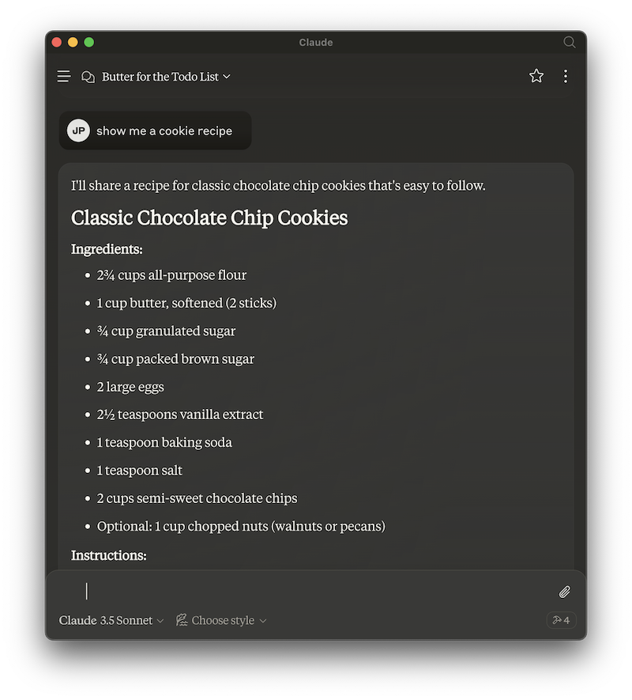

# Model Context Protocol and Fireproof Demo: To Do List

This is a simple example of how to use a [Fireproof](https://fireproof.storage/) database in a [Model Context Protocol](https://github.com/modelcontextprotocol) server (used for plugging code and data into A.I. systems such as [Claude Desktop](https://claude.ai/download)).

This demo server implements a simple "To Do List", using the same fields as in
the demo on the [Fireproof Homepage Codepen](https://codepen.io/jchrisa/pen/bGOGvBz).


Once installed, this MCP server exposes a "todos" service. If you are using Claude Desktop, you can interact with it via the chatbot to create "To Do List" items, mark them as done, delete them, and even summarize the list.

Here's an example chat where I've asked Claude to "add butter to my todo list":


Where it really gets interesting is when you combine it with knowledge that Claude already has, or with other tools.

If I ask Claude for a cookie recipe:



I can add all the ingredients to the todo list with a natural language request...


You can do other fun things, like mark todos as done, as well as delete them.


# Installation

First, make sure you have [Node.js](https://nodejs.org/) installed.

Clone the repo:
```bash
git clone https://github.com/jimpick/mcp-fireproof-todos.git
```

Change directory:
```bash
cd mcp-fireproof-todos
```

Install dependencies:
```bash
npm install
```

Build the server:
```bash
npm run build
```

To use with Claude Desktop, add the server config:

On MacOS: `~/Library/Application Support/Claude/claude_desktop_config.json`

On Windows: `%APPDATA%/Claude/claude_desktop_config.json`

```json
{
  "mcpServers": {
    "todos": {
      "command": "/path/to/todos/build/index.js"
    }
  }
}
```


# Development Notes

Mostly, this was developed following the
tutorial here:

* https://modelcontextprotocol.io/docs/first-server/typescript

Fireproof support was added:

```ts
import { fireproof } from "use-fireproof";

const db = fireproof("mcp_todo", { public: true });
```

The fields were defined:

```ts
/**
 * Type alias for a todo object.
 */
type Todo = {
  _id: string,
  done: boolean,
  text: string,
  created: Number,
  updated: Number
};
```

I'm keeping an in-memory list of items, which is kept updated with a `.subscribe()` method. It might have been simpler to just query the items in the "list_todos" tool.

```ts
const todos: { [id: string]: Todo } = {}

await db.ready()

const onDbEvent = async function () {
  const run = Math.random()
  const fpTodos = await db.query("created", {
    includeDocs: true,
    descending: true,
    limit: 10,
  });
  for (let id in todos) {
    delete todos[id]
  }
  for (const row of fpTodos.rows) {
    let todo = row.doc;
    todos[todo!._id] = todo as Todo
  }
};
onDbEvent();
db.subscribe(onDbEvent);
```

We register the following tools using `server.setRequestHandler()` with [ListToolsRequestSchema](https://github.com/jimpick/mcp-fireproof-todos/blob/8706fc409a0c122f7ee1ad42b35219a086fbd599/src/index.ts#L126):

* create_todo
* list_todos
* mark_todo_as_done
* delete_todo

And there are simple implementations for each using `server.setRequestHandler()` with [CallToolRequestSchema](https://github.com/jimpick/mcp-fireproof-todos/blob/8706fc409a0c122f7ee1ad42b35219a086fbd599/src/index.ts#L184).

# License

Apache 2 or MIT
